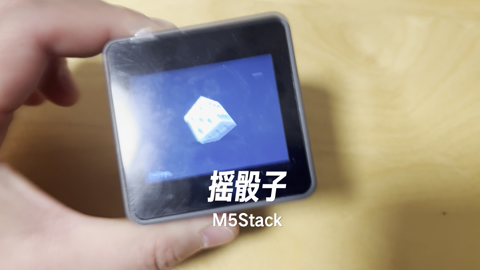

# Dice Roller 3D for M5Stack CoreS3

  

  A polished fake-3D dice roller for <strong>M5Stack CoreS3</strong>, built with <strong>UIFlow2</strong> and flashed with <strong>M5Burner</strong>.

  Shake it. Tap it. Hear it. Watch the dice tumble and land on the exact face shown on screen.

  <a href="demo/m5stack-cores3-dice-demo.mp4">Watch full demo video</a>

## Highlights

- Fake-3D sprite animation tuned for CoreS3 instead of trying to render real 3D on-device
- Dual trigger modes: `IMU shake` and `touch screen`
- Sound feedback for ready, roll, and landing
- Large on-screen dice with a more dramatic tumbling motion
- Final numeric result derived from the visible landing face instead of a disconnected RNG display
- Static HUD rendering to avoid text flicker during animation

## Demo

Full recorded demo:

- [demo/m5stack-cores3-dice-demo.mp4](demo/m5stack-cores3-dice-demo.mp4)

## Stack

- Hardware: `M5Stack CoreS3`
- Firmware: `UIFlow2`
- Flash tool: `M5Burner`
- Runtime: `MicroPython`
- Host-side asset workflow: `Python + Pillow + ffmpeg`

## Project Layout

- [`main.py`](main.py): Core app logic for animation, touch, IMU, audio, HUD, and final result
- [`boot.py`](boot.py): Boot entry
- [`make_dice_spin.py`](make_dice_spin.py): Generates the fake-3D rolling dice frames
- [`make_dice_alpha.py`](make_dice_alpha.py): Background cleanup helper for sprite assets
- [`uiflow_upload/dice`](uiflow_upload/dice): Final upload-ready dice frames used on the device
- [`dice_frames`](dice_frames): Source and intermediate frame assets
- [`demo`](demo): Demo video, GIF preview, and cover image

## Run on Device

1. Flash `UIFlow2` to the CoreS3 using `M5Burner`.
2. Upload [`main.py`](main.py) to `/flash/main.py`.
3. Upload [`uiflow_upload/dice`](uiflow_upload/dice) to `/flash/res/dice/`.
4. Reset the board.
5. Trigger a roll by shaking the device or touching the screen.

## Notes

- This project intentionally uses pre-rendered frame animation for the 3D effect. That gives a cleaner result on CoreS3 than trying to do true 3D rendering in UIFlow2.
- The final displayed number is synchronized to the landing face shown on screen.
- The HUD is drawn as a mostly static layer so labels do not flash during animation.
